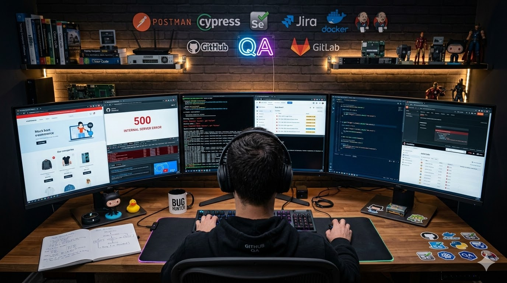

# 👨‍💻  QA Engineer

💡 *"Quality is never an accident; it is always the result of intelligent effort."*

Sou apaixonado por tecnologia e qualidade de software.  
Atualmente estou focado em **Quality Assurance (QA)**, buscando garantir que sistemas sejam confiáveis, funcionais e entreguem a melhor experiência possível para o usuário.

🚀 Em constante aprendizado e evolução na área de tecnologia.

---

  

 

 

## 🔎 Sobre mim

- 🎯 Focado em **Quality Assurance**
- 🧠 **Testes de Software**
- 💻 Experiência com tecnologia e suporte
- 📚 **automação de testes**
- 🚀 **QA Automation Engineer**

---

## 🛠️ Habilidades

- Testes Manuais
- Testes Funcionais
- Testes Exploratórios
- Análise de Bugs
- Git & GitHub
- Lógica de Programação
- JavaScript 
